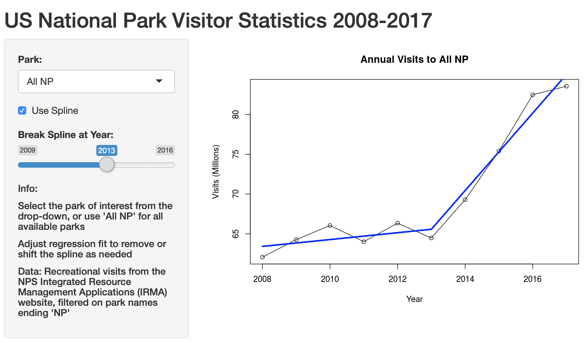

```{r setup, include=FALSE}
library(knitr)
knitr::opts_chunk$set(echo = FALSE)
```

```{r libraries, message=FALSE}
library(kableExtra)
library(data.table)
```

```{r load_data}
source('global.R')
```

## US National Parks - Visitation Data
Data for visits to US National Parks was obtained from the NPS Integrated Resource Management Applications (IRMA) website, filtered for parks ending in "NP" (```r length(parklist)-1``` parks).

Link to data:

<font size="2">
https://irma.nps.gov/Stats/SSRSReports/National%20Reports/Annual%20Visitation%20By%20Park%20(1979%20-%20Last%20Calendar%20Year)
</font>
<font size="4">

Total visits by Year (millions, all NPs):
```{r do_table}
tots_table<-tots_df[,2:3]
tots_table$Visits<-tots_table$Visits/1000000
transpose(tots_table)[2,] %>% kable(
                col.names=tots_table[,1],
                row.names=F,
                booktabs=T,
                digits=rep(2,nrow(tots_table))) %>%
                kable_styling(latex_options = "hold_position")
```
</font>

## National Park Widget
The national park widget is a shiny app that will provide easy access to examine trends in this data, either across all parks or by individual park.  The widget will fit either a spline regression (default), or simple linear regression.

The following user inputs will be available:

- **Park** - Dropdown to select a specific park, defaulted to "All NP" for all parks
- **Use Spline** - Checkbox whether to use a spline model or not
- **Break Spline at Year** - Slider between 2009 and 2016 to define where to break the spline, defaulted to 2013

## Screenshot and Link

Demo screenshot of the widget showing default settings:

```{r widget_screenshot, out.width = "500px", fig.align="center"}

```

Link to widget:

<font size="3">
https://ringspagit.shinyapps.io/NationalParkWidget/
</font>

## Thank You for your review of the National Park Widget

```{r fancy_logo, out.width = "300px", fig.align="center"}

```